# S? ?? ERD - SHOPWAVE DATABASE

## ?? Entity Relationship Diagram

```mermaid
erDiagram
    %% USER MANAGEMENT
    Users ||--o{ Orders : places
    Users ||--o{ Notifications : receives
    Users ||--o{ UserSettings : has
    Users ||--o{ UserSessions : has
    Users ||--o{ UserMedia : has
    Users ||--o{ Carts : owns

    %% PRODUCT STRUCTURE
    Categories ||--o{ Products : contains
    Categories ||--o{ Categories : "parent-child"
    Products ||--o{ ProductVariants : has
    Products ||--o{ ProductOptions : has
    Products ||--o{ ProductMedia : has
    Products }o--|| Media : "main image"
    
    ProductOptions ||--o{ OptionValues : has
    ProductVariants ||--o{ VariantValues : has
    OptionValues ||--o{ VariantValues : defines
    ProductVariants }o--|| Media : "variant image"
    OptionValues }o--|| Media : thumbnail
    ProductMedia }o--|| Media : references

    %% CART & DISCOUNT
    Carts ||--o{ CartItems : contains
    Carts ||--o{ AppliedDiscounts : has
    CartItems }o--|| ProductVariants : references
    AppliedDiscounts }o--|| Discounts : applies
    
    %% ORDER & PAYMENT
    Orders ||--o{ OrderItems : contains
    Orders ||--o{ Transactions : has
    OrderItems }o--|| ProductVariants : references
    
    %% LOCATION
    Provinces ||--o{ Districts : contains
    Districts ||--o{ Wards : contains
    
    %% MEDIA
    Media ||--o{ UserMedia : used-in
    
    Users {
        uniqueidentifier Id PK
        nvarchar Email UK
        nvarchar PasswordHash
        nvarchar FullName
        nvarchar Phone
        nvarchar Role
        bit IsActive
        datetime2 CreatedAt
        datetime2 UpdatedAt
    }
    
    Products {
        uniqueidentifier Id PK
        nvarchar Name
        nvarchar Description
        uniqueidentifier CategoryId FK
        bigint MediaId FK
        decimal DisplayPrice
        int TotalInventory
        int VariantCount
        int Popularity
        bit IsActive
        datetime2 CreatedAt
        datetime2 UpdatedAt
    }
    
    ProductVariants {
        uniqueidentifier Id PK
        uniqueidentifier ProductId FK
        nvarchar Sku
        decimal Price
        int Stock
        bigint ImageId FK
    }
    
    ProductOptions {
        uniqueidentifier Id PK
        uniqueidentifier ProductId FK
        nvarchar Name
        nvarchar DisplayType
    }
    
    OptionValues {
        uniqueidentifier Id PK
        uniqueidentifier OptionId FK
        nvarchar Value
        bigint ThumbnailId FK
    }
    
    VariantValues {
        uniqueidentifier VariantId FK,PK
        uniqueidentifier ValueId FK,PK
    }
    
    Categories {
        uniqueidentifier Id PK
        nvarchar Name
        nvarchar Description
        uniqueidentifier ParentId FK
        nvarchar ImageUrl
        int SortOrder
        bit IsActive
        datetime2 CreatedAt
        datetime2 UpdatedAt
    }
    
    Carts {
        uniqueidentifier Id PK
        uniqueidentifier UserId FK
        nvarchar SessionId
        datetime2 CreatedAt
        datetime2 UpdatedAt
    }
    
    CartItems {
        uniqueidentifier Id PK
        uniqueidentifier CartId FK
        uniqueidentifier ProductVariantId FK
        int Quantity
        decimal UnitPrice
        datetime2 CreatedAt
        datetime2 UpdatedAt
    }
    
    Discounts {
        uniqueidentifier Id PK
        nvarchar Code UK
        nvarchar Description
        int DiscountType
        decimal DiscountValue
        decimal MinOrderAmount
        datetime2 StartDate
        datetime2 EndDate
        int UsageLimit
        int UsageCount
        bit IsActive
        datetime2 CreatedAt
        datetime2 UpdatedAt
    }
    
    AppliedDiscounts {
        uniqueidentifier Id PK
        uniqueidentifier CartId FK
        uniqueidentifier DiscountId FK
        decimal DiscountAmountApplied
        datetime2 AppliedAt
    }
    
    DiscountTiers {
        uniqueidentifier Id PK
        decimal ThresholdAmount
        decimal DiscountValue
        nvarchar Description
        bit IsActive
        datetime2 CreatedAt
        datetime2 UpdatedAt
    }
    
    Orders {
        uniqueidentifier Id PK
        uniqueidentifier UserId FK
        nvarchar OrderNumber UK
        datetime2 OrderDate
        nvarchar Status
        nvarchar PaymentStatus
        nvarchar PaymentMethod
        decimal SubTotal
        decimal ShippingFee
        decimal DiscountAmount
        decimal ProgressiveDiscountAmount
        decimal VoucherDiscountAmount
        nvarchar VoucherCode
        decimal TotalAmount
        nvarchar ShippingFullName
        nvarchar ShippingPhone
        nvarchar ShippingStreet
        nvarchar ShippingWard
        nvarchar ShippingDistrict
        nvarchar ShippingProvince
        nvarchar ShippingNotes
        datetime2 CreatedAt
        datetime2 UpdatedAt
    }
    
    OrderItems {
        uniqueidentifier Id PK
        uniqueidentifier OrderId FK
        uniqueidentifier ProductVariantId FK
        nvarchar ProductName
        int Quantity
        decimal UnitPrice
        decimal TotalPrice
        nvarchar VariantImageUrl
        nvarchar SelectedOptions
        datetime2 CreatedAt
    }
    
    Transactions {
        uniqueidentifier Id PK
        uniqueidentifier OrderId FK
        nvarchar Gateway
        nvarchar GatewayTransactionId
        decimal Amount
        nvarchar Status
        nvarchar TransactionType
        nvarchar GatewayResponse
        nvarchar ErrorMessage
        nvarchar IpAddress
        nvarchar UserAgent
        datetime2 CreatedAt
        datetime2 UpdatedAt
        datetime2 CompletedAt
    }
    
    Media {
        bigint Id PK
        nvarchar FileName
        nvarchar OriginalFileName
        nvarchar Url
        varchar MimeType
        bigint FileSize
        varchar Category
        datetime2 CreatedAt
    }
    
    Provinces {
        int Id PK
        nvarchar Name
        nvarchar Code
    }
    
    Districts {
        int Id PK
        nvarchar Name
        int ProvinceId FK
    }
    
    Wards {
        int Id PK
        nvarchar Name
        int DistrictId FK
    }
    
    ShippingRates {
        uniqueidentifier Id PK
        nvarchar Province UK
        decimal Fee
        datetime2 CreatedAt
        datetime2 UpdatedAt
    }
    
    UserSessions {
        uniqueidentifier Id PK
        uniqueidentifier UserId FK
        nvarchar SessionToken
        nvarchar IpAddress
        nvarchar UserAgent
        datetime2 CreatedAt
        datetime2 LastActivity
        datetime2 ExpiresAt
    }
    
    UserSettings {
        uniqueidentifier Id PK
        uniqueidentifier UserId FK
        nvarchar SettingKey
        nvarchar SettingValue
        datetime2 CreatedAt
        datetime2 UpdatedAt
    }
    
    UserMedia {
        uniqueidentifier UserId FK,PK
        bigint MediaId FK,PK
        varchar MediaType PK
    }
    
    ProductMedia {
        uniqueidentifier ProductId FK,PK
        bigint MediaId FK,PK
        int DisplayOrder
    }
    
    Notifications {
        uniqueidentifier Id PK
        uniqueidentifier UserId FK
        nvarchar Type
        nvarchar Title
        nvarchar Message
        bit IsRead
        datetime2 ReadAt
        datetime2 CreatedAt
    }
```



---

## ?? Các lo?i quan h? chính

### **1:N (One-to-Many)**
| B?ng cha         | B?ng con           | Mô t?                          |
|------------------|--------------------|--------------------------------|
| Users            | Orders             | M?t user có nhi?u ??n hàng     |
| Users            | Notifications      | M?t user có nhi?u thông báo    |
| Users            | Carts              | M?t user có nhi?u gi? hàng     |
| Categories       | Products           | M?t danh m?c có nhi?u s?n ph?m |
| Products         | ProductVariants    | M?t s?n ph?m có nhi?u variants |
| Products         | ProductOptions     | M?t s?n ph?m có nhi?u options  |
| ProductOptions   | OptionValues       | M?t option có nhi?u values     |
| Carts            | CartItems          | M?t gi? hàng có nhi?u items    |
| Orders           | OrderItems         | M?t ??n hàng có nhi?u items    |
| Orders           | Transactions       | M?t ??n hàng có nhi?u giao d?ch|
| Provinces        | Districts          | M?t t?nh có nhi?u qu?n         |
| Districts        | Wards              | M?t qu?n có nhi?u ph??ng       |

### **N:M (Many-to-Many)**
| B?ng trung gian   | B?ng 1            | B?ng 2          | Mô t?                                  |
|-------------------|-------------------|-----------------|----------------------------------------|
| VariantValues     | ProductVariants   | OptionValues    | Variant có nhi?u option values         |
| ProductMedia      | Products          | Media           | Product có nhi?u media                 |
| UserMedia         | Users             | Media           | User có nhi?u media (avatar, cover)    |
| AppliedDiscounts  | Carts             | Discounts       | Cart có th? có nhi?u discounts applied |

### **Self-Reference (?? quy)**
| B?ng       | Quan h?      | Mô t?                        |
|------------|--------------|------------------------------|
| Categories | ParentId     | Danh m?c cha-con (hierarchy) |

---

## ?? Ví d? th?c t?

### **Ví d? 1: S?n ph?m "Áo thun" v?i variants**

```
Product: "Áo thun Basic"
??? Option 1: "Màu s?c" (Color)
?   ??? Value: "??" (Red)
?   ??? Value: "Xanh" (Blue)
?   ??? Value: "Tr?ng" (White)
??? Option 2: "Kích th??c" (Size)
    ??? Value: "S"
    ??? Value: "M"
    ??? Value: "L"

Variants (9 combinations):
1. Áo thun ?? - S (SKU: SHIRT-RED-S, Price: 150000, Stock: 10)
   ??? VariantValues: [Red, S]
2. Áo thun ?? - M (SKU: SHIRT-RED-M, Price: 150000, Stock: 15)
   ??? VariantValues: [Red, M]
3. Áo thun ?? - L (SKU: SHIRT-RED-L, Price: 150000, Stock: 20)
   ??? VariantValues: [Red, L]
...
```

### **Ví d? 2: Quy trình ??t hàng**

```
1. User thêm variant vào cart
   ??? CartItem (CartId, ProductVariantId, Quantity, UnitPrice)

2. User áp d?ng voucher "NOV40"
   ??? AppliedDiscount (CartId, DiscountId, DiscountAmountApplied)

3. Checkout t?o Order
   ??? Order (UserId, OrderNumber, SubTotal, VoucherDiscountAmount, TotalAmount)
       ??? OrderItems (snapshot c?a CartItems)

4. User thanh toán VNPay
   ??? Transaction (OrderId, Gateway: "VNPAY", Status: "PENDING")

5. Webhook confirm thanh toán thành công
   ??? Transaction.Status = "SUCCESS"
   ??? Order.PaymentStatus = "PAID"
   ??? ProductVariant.Stock gi?m ?i
```

### **Ví d? 3: Progressive Discount**

```
DiscountTiers:
1. Threshold: 300,000 VND ? Discount: 15,000 VND
2. Threshold: 500,000 VND ? Discount: 50,000 VND
3. Threshold: 1,000,000 VND ? Discount: 100,000 VND

N?u SubTotal = 450,000 VND:
? Áp d?ng tier 1 (300k): gi?m 15,000 VND
? Còn thi?u 50,000 VND ?? lên tier 2 (gi?m thêm 35,000 VND)
```

---

## ?? Các tr??ng h?p ??c bi?t

### **1. Guest Checkout (Khách vãng lai)**
```
Cart:
  UserId = NULL
  SessionId = "abc123-session-guid"

Order:
  UserId = NULL
  ShippingFullName = "Nguy?n V?n A"
  ...
```

### **2. Product Snapshot trong Order**
```
OrderItem:
  ProductName = "Áo thun Basic" (snapshot t?i th?i ?i?m ??t hàng)
  UnitPrice = 150,000 (giá t?i th?i ?i?m ??t hàng)
  VariantImageUrl = "https://..." (?nh t?i th?i ?i?m ??t hàng)
  SelectedOptions = '[{"Name":"Màu s?c","Value":"??"},{"Name":"Kích th??c","Value":"M"}]'
```

### **3. Location Hierarchy**
```
Hà N?i (Province)
??? Ba ?ình (District)
?   ??? Phúc Xá (Ward)
?   ??? Trúc B?ch (Ward)
?   ??? ...
??? Hoàn Ki?m (District)
?   ??? Hàng B?c (Ward)
?   ??? Hàng Bài (Ward)
?   ??? ...
??? ...
```

---

## ?? Query Examples

### **1. L?y t?t c? variants c?a m?t s?n ph?m**
```sql
SELECT 
    pv.Id AS VariantId,
    pv.Sku,
    pv.Price,
    pv.Stock,
    po.Name AS OptionName,
    ov.Value AS OptionValue
FROM ProductVariants pv
INNER JOIN VariantValues vv ON pv.Id = vv.VariantId
INNER JOIN OptionValues ov ON vv.ValueId = ov.Id
INNER JOIN ProductOptions po ON ov.OptionId = po.Id
WHERE pv.ProductId = 'product-guid-here'
ORDER BY pv.Sku, po.Name
```

### **2. L?y gi? hàng v?i chi ti?t s?n ph?m**
```sql
SELECT 
    c.Id AS CartId,
    ci.Quantity,
    ci.UnitPrice,
    p.Name AS ProductName,
    pv.Sku,
    pv.Price AS CurrentPrice,
    pv.Stock
FROM Carts c
INNER JOIN CartItems ci ON c.Id = ci.CartId
INNER JOIN ProductVariants pv ON ci.ProductVariantId = pv.Id
INNER JOIN Products p ON pv.ProductId = p.Id
WHERE c.UserId = 'user-guid-here'
```

### **3. L?y ??n hàng v?i t?ng gi?m giá**
```sql
SELECT 
    o.OrderNumber,
    o.SubTotal,
    o.ProgressiveDiscountAmount,
    o.VoucherDiscountAmount,
    o.DiscountAmount AS TotalDiscount,
    o.ShippingFee,
    o.TotalAmount,
    o.VoucherCode,
    o.Status,
    o.PaymentStatus
FROM Orders o
WHERE o.UserId = 'user-guid-here'
ORDER BY o.OrderDate DESC
```

---

## ?? Th?ng kê b?ng

| Nhóm ch?c n?ng        | S? b?ng | B?ng chính                                           |
|-----------------------|---------|------------------------------------------------------|
| User Management       | 4       | Users, UserSessions, UserSettings, UserMedia        |
| Product Management    | 6       | Products, ProductVariants, ProductOptions, OptionValues, VariantValues, ProductMedia |
| Cart & Wishlist       | 2       | Carts, CartItems                                     |
| Discount & Pricing    | 3       | Discounts, AppliedDiscounts, DiscountTiers           |
| Order Management      | 3       | Orders, OrderItems, Transactions                     |
| Media & Category      | 3       | Media, Categories, Notifications                     |
| Location & Shipping   | 4       | Provinces, Districts, Wards, ShippingRates           |
| **T?ng c?ng**         | **26**  |                                                      |

---

## ?? Cascade Behaviors

| Parent ? Child             | Delete Behavior | Ghi chú                                      |
|----------------------------|-----------------|----------------------------------------------|
| Users ? Orders             | SetNull         | Orders of deleted users become guest orders  |
| Users ? UserSessions       | Cascade         | Delete all sessions when user is deleted     |
| Users ? Carts              | Cascade         | Delete cart when user is deleted             |
| Products ? ProductVariants | Cascade         | Delete variants when product is deleted      |
| Carts ? CartItems          | Cascade         | Delete items when cart is deleted            |
| Orders ? OrderItems        | Cascade         | Delete items when order is deleted           |
| Categories ? Products      | Restrict        | Cannot delete category with existing products|
| ProductVariants ? CartItems| Restrict        | Cannot delete variant in active carts        |

---

**Tài li?u liên quan**:
- `DATABASE_SCHEMA_DOCUMENTATION.md` - Chi ti?t ??y ?? t?ng b?ng
- `MIGRATION_GUIDE.md` - H??ng d?n migration
- `HOW_TO_REFRESH_DATABASE.md` - Reset database

**Phiên b?n**: 1.0  
**Ngày t?o**: 2024-12-25
