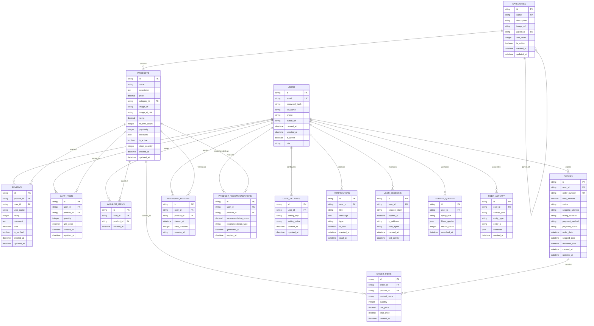

# Sơ đồ Cơ sở Dữ liệu ShopWave - Mermaid Diagram

## Giải thích các mối quan hệ chính:

### 1. Quan hệ User-centric (Người dùng là trung tâm)

- **USERS** là bảng trung tâm kết nối với hầu hết các bảng khác
- Mỗi user có thể có nhiều reviews, cart items, wishlist items, orders, v.v.

### 2. Quan hệ Product-centric (Sản phẩm là trung tâm)

- **PRODUCTS** kết nối với categories, reviews, cart, wishlist, orders
- **CATEGORIES** có thể có cấu trúc cây (parent-child relationship)

### 3. Quan hệ Order Management (Quản lý đơn hàng)

- **ORDERS** chứa thông tin tổng quan về đơn hàng
- **ORDER_ITEMS** chứa chi tiết từng sản phẩm trong đơn hàng

### 4. Quan hệ AI & Analytics (Trí tuệ nhân tạo & Phân tích)

- **BROWSING_HISTORY** theo dõi hành vi người dùng
- **PRODUCT_RECOMMENDATIONS** lưu trữ gợi ý từ AI
- **USER_ACTIVITY** ghi lại mọi hoạt động của người dùng

### 5. Quan hệ System Management (Quản lý hệ thống)

- **USER_SETTINGS** lưu cài đặt cá nhân
- **NOTIFICATIONS** quản lý thông báo
- **USER_SESSIONS** quản lý phiên đăng nhập
