# Sơ đồ Use Case chi tiết - ShopWave Ecommerce

## Sơ đồ Use Case với mối quan hệ

```mermaid
graph TB
    %% Actors
    Customer[👤 Khách hàng]
    Guest[👤 Khách vãng lai]
    Admin[👨‍💼 Quản trị viên]
    System[🤖 Hệ thống AI]

    %% Customer Use Cases
    Customer --> UC1[Đăng ký tài khoản]
    Customer --> UC2[Đăng nhập]
    Customer --> UC3[Xem danh sách sản phẩm]
    Customer --> UC4[Tìm kiếm sản phẩm]
    Customer --> UC5[Lọc sản phẩm theo tiêu chí]
    Customer --> UC6[Xem chi tiết sản phẩm]
    Customer --> UC7[Thêm sản phẩm vào giỏ hàng]
    Customer --> UC8[Xem giỏ hàng]
    Customer --> UC9[Cập nhật số lượng sản phẩm]
    Customer --> UC10[Xóa sản phẩm khỏi giỏ hàng]
    Customer --> UC11[Thêm sản phẩm vào wishlist]
    Customer --> UC12[Xem danh sách wishlist]
    Customer --> UC13[Xóa sản phẩm khỏi wishlist]
    Customer --> UC14[Tạo đơn hàng]
    Customer --> UC15[Xem lịch sử đơn hàng]
    Customer --> UC16[Theo dõi trạng thái đơn hàng]
    Customer --> UC17[Viết đánh giá sản phẩm]
    Customer --> UC18[Xem đánh giá sản phẩm]
    Customer --> UC19[Quản lý hồ sơ cá nhân]
    Customer --> UC20[Cập nhật thông tin cá nhân]
    Customer --> UC21[Thay đổi mật khẩu]
    Customer --> UC22[Cài đặt thông báo]
    Customer --> UC23[Xem thông báo]
    Customer --> UC24[Đăng xuất]

    %% Guest Use Cases
    Guest --> UC3
    Guest --> UC4
    Guest --> UC5
    Guest --> UC6
    Guest --> UC18
    Guest --> UC25[Đăng ký tài khoản để mua hàng]

    %% Admin Use Cases
    Admin --> UC26[Quản lý sản phẩm]
    Admin --> UC27[Thêm sản phẩm mới]
    Admin --> UC28[Cập nhật thông tin sản phẩm]
    Admin --> UC29[Xóa sản phẩm]
    Admin --> UC30[Quản lý danh mục sản phẩm]
    Admin --> UC31[Thêm danh mục mới]
    Admin --> UC32[Cập nhật danh mục]
    Admin --> UC33[Xóa danh mục]
    Admin --> UC34[Quản lý đơn hàng]
    Admin --> UC35[Xem tất cả đơn hàng]
    Admin --> UC36[Cập nhật trạng thái đơn hàng]
    Admin --> UC37[Quản lý người dùng]
    Admin --> UC38[Xem danh sách người dùng]
    Admin --> UC39[Khóa/mở khóa tài khoản người dùng]
    Admin --> UC40[Quản lý đánh giá]
    Admin --> UC41[Duyệt đánh giá mới]
    Admin --> UC42[Xóa đánh giá không phù hợp]
    Admin --> UC43[Xem báo cáo thống kê]
    Admin --> UC44[Quản lý cài đặt hệ thống]

    %% System AI Use Cases
    System --> UC45[Gợi ý sản phẩm dựa trên lịch sử]
    System --> UC46[Theo dõi hành vi duyệt web]
    System --> UC47[Phân tích xu hướng mua sắm]
    System --> UC48[Tối ưu hóa kết quả tìm kiếm]
    System --> UC49[Tự động cập nhật rating sản phẩm]
    System --> UC50[Gửi thông báo tự động]

    %% Include Relationships
    UC2 -.->|include| UC7
    UC2 -.->|include| UC11
    UC2 -.->|include| UC14
    UC2 -.->|include| UC15
    UC2 -.->|include| UC17
    UC2 -.->|include| UC19
    UC3 -.->|include| UC6
    UC4 -.->|include| UC6
    UC5 -.->|include| UC6
    UC6 -.->|include| UC7
    UC6 -.->|include| UC11
    UC6 -.->|include| UC17
    UC7 -.->|include| UC8
    UC8 -.->|include| UC9
    UC8 -.->|include| UC10
    UC8 -.->|include| UC14
    UC11 -.->|include| UC12
    UC12 -.->|include| UC13
    UC12 -.->|include| UC7
    UC14 -.->|include| UC15
    UC15 -.->|include| UC16
    UC17 -.->|include| UC18
    UC19 -.->|include| UC20
    UC19 -.->|include| UC21
    UC19 -.->|include| UC22
    UC25 -.->|include| UC1
    UC26 -.->|include| UC27
    UC26 -.->|include| UC28
    UC26 -.->|include| UC29
    UC30 -.->|include| UC31
    UC30 -.->|include| UC32
    UC30 -.->|include| UC33
    UC34 -.->|include| UC35
    UC34 -.->|include| UC36
    UC37 -.->|include| UC38
    UC37 -.->|include| UC39
    UC40 -.->|include| UC41
    UC40 -.->|include| UC42
    UC46 -.->|include| UC45
    UC47 -.->|include| UC45
    UC17 -.->|include| UC49
    UC14 -.->|include| UC50
    UC36 -.->|include| UC50

    %% Extend Relationships
    UC7 -.->|extend| UC25
    UC11 -.->|extend| UC25
    UC14 -.->|extend| UC25

    %% Styling
    classDef customerClass fill:#e3f2fd,stroke:#1976d2,stroke-width:2px
    classDef guestClass fill:#f3e5f5,stroke:#7b1fa2,stroke-width:2px
    classDef adminClass fill:#fff3e0,stroke:#f57c00,stroke-width:2px
    classDef systemClass fill:#e8f5e8,stroke:#388e3c,stroke-width:2px

    class Customer customerClass
    class Guest guestClass
    class Admin adminClass
    class System systemClass
```



## Mô tả chi tiết các mối quan hệ

### **Include Relationship (Bao gồm)**

Các Use Case được bao gồm trong Use Case khác:

#### **Khách hàng**

- **Đăng nhập** bao gồm: Thêm vào giỏ hàng, Thêm vào wishlist, Đặt hàng, Xem lịch sử đơn hàng, Viết đánh giá, Quản lý hồ sơ
- **Xem danh sách sản phẩm** bao gồm: Xem chi tiết sản phẩm
- **Tìm kiếm sản phẩm** bao gồm: Xem chi tiết sản phẩm
- **Lọc sản phẩm** bao gồm: Xem chi tiết sản phẩm
- **Xem chi tiết sản phẩm** bao gồm: Thêm vào giỏ hàng, Thêm vào wishlist, Viết đánh giá
- **Thêm vào giỏ hàng** bao gồm: Xem giỏ hàng
- **Xem giỏ hàng** bao gồm: Cập nhật số lượng, Xóa sản phẩm, Tạo đơn hàng
- **Thêm vào wishlist** bao gồm: Xem danh sách wishlist
- **Xem danh sách wishlist** bao gồm: Xóa sản phẩm, Thêm vào giỏ hàng
- **Tạo đơn hàng** bao gồm: Xem lịch sử đơn hàng
- **Xem lịch sử đơn hàng** bao gồm: Theo dõi trạng thái đơn hàng
- **Viết đánh giá** bao gồm: Xem đánh giá sản phẩm
- **Quản lý hồ sơ** bao gồm: Cập nhật thông tin, Thay đổi mật khẩu, Cài đặt thông báo

#### **Khách vãng lai**

- **Đăng ký tài khoản để mua hàng** bao gồm: Đăng ký tài khoản

#### **Quản trị viên**

- **Quản lý sản phẩm** bao gồm: Thêm sản phẩm, Cập nhật sản phẩm, Xóa sản phẩm
- **Quản lý danh mục** bao gồm: Thêm danh mục, Cập nhật danh mục, Xóa danh mục
- **Quản lý đơn hàng** bao gồm: Xem đơn hàng, Cập nhật trạng thái
- **Quản lý người dùng** bao gồm: Xem danh sách, Khóa/mở khóa tài khoản
- **Quản lý đánh giá** bao gồm: Duyệt đánh giá, Xóa đánh giá

#### **Hệ thống AI**

- **Theo dõi hành vi** bao gồm: Gợi ý sản phẩm
- **Phân tích xu hướng** bao gồm: Gợi ý sản phẩm
- **Viết đánh giá** bao gồm: Tự động cập nhật rating
- **Tạo đơn hàng** bao gồm: Gửi thông báo tự động
- **Cập nhật trạng thái đơn hàng** bao gồm: Gửi thông báo tự động

### **Extend Relationship (Mở rộng)**

Các Use Case mở rộng Use Case khác:

- **Thêm vào giỏ hàng** mở rộng: Đăng ký tài khoản để mua hàng
- **Thêm vào wishlist** mở rộng: Đăng ký tài khoản để mua hàng
- **Tạo đơn hàng** mở rộng: Đăng ký tài khoản để mua hàng

## Luồng Use Case chính

### **1. Luồng mua sắm hoàn chỉnh (Customer)**

```
Đăng nhập → Duyệt sản phẩm → Tìm kiếm/Lọc → Xem chi tiết →
Thêm vào giỏ hàng → Xem giỏ hàng → Cập nhật số lượng →
Tạo đơn hàng → Xem lịch sử đơn hàng → Theo dõi trạng thái
```

### **2. Luồng khách vãng lai chuyển đổi**

```
Duyệt sản phẩm → Tìm kiếm/Lọc → Xem chi tiết →
Thêm vào giỏ hàng (mở rộng) → Đăng ký tài khoản →
Chuyển thành khách hàng → Hoàn tất mua hàng
```

### **3. Luồng quản lý sản phẩm (Admin)**

```
Đăng nhập Admin → Quản lý sản phẩm → Thêm/Cập nhật/Xóa sản phẩm →
Quản lý danh mục → Thêm/Cập nhật/Xóa danh mục
```

### **4. Luồng AI tự động**

```
Theo dõi hành vi → Phân tích xu hướng → Gợi ý sản phẩm →
Tự động cập nhật rating → Gửi thông báo
```

## Đặc điểm nổi bật của sơ đồ

### **🎯 User Experience tối ưu**

- **Khách vãng lai** có thể duyệt sản phẩm mà không cần đăng ký
- **Khách hàng** có trải nghiệm mua sắm liền mạch
- **Admin** có công cụ quản lý toàn diện

### **🤖 AI Integration thông minh**

- Gợi ý sản phẩm dựa trên hành vi
- Tự động cập nhật dữ liệu
- Thông báo thông minh

### **🔒 Bảo mật và phân quyền**

- Phân quyền rõ ràng giữa các Actor
- Bảo mật thông tin cá nhân
- Kiểm duyệt nội dung

### **📊 Analytics và báo cáo**

- Báo cáo doanh thu chi tiết
- Thống kê hành vi người dùng
- Phân tích xu hướng

### **🔄 Tự động hóa**

- Cập nhật rating tự động
- Gửi thông báo tự động
- Tối ưu hóa tìm kiếm

---

**Kết luận**: Sơ đồ Use Case chi tiết này mô tả đầy đủ các chức năng của ShopWave với các mối quan hệ rõ ràng, đảm bảo trải nghiệm người dùng tốt nhất và khả năng quản lý hiệu quả cho admin.
