# Sơ đồ Use Case - ShopWave Ecommerce

## Tổng quan

Sơ đồ Use Case mô tả các chức năng chính của hệ thống ShopWave ecommerce và mối quan hệ giữa các Actor (người dùng) và Use Cases (chức năng).

## Sơ đồ Use Case

```mermaid
graph TB
    %% Actors
    Customer[👤 Khách hàng]
    Guest[👤 Khách vãng lai]
    Admin[👨‍💼 Quản trị viên]
    System[🤖 Hệ thống AI]

    %% Customer Use Cases
    Customer --> UC1[Đăng ký tài khoản]
    Customer --> UC2[Đăng nhập]
    Customer --> UC3[Xem danh sách sản phẩm]
    Customer --> UC4[Tìm kiếm sản phẩm]
    Customer --> UC5[Lọc sản phẩm]
    Customer --> UC6[Xem chi tiết sản phẩm]
    Customer --> UC7[Thêm vào giỏ hàng]
    Customer --> UC8[Xem giỏ hàng]
    Customer --> UC9[Cập nhật giỏ hàng]
    Customer --> UC10[Xóa khỏi giỏ hàng]
    Customer --> UC11[Thêm vào wishlist]
    Customer --> UC12[Xem wishlist]
    Customer --> UC13[Xóa khỏi wishlist]
    Customer --> UC14[Đặt hàng]
    Customer --> UC15[Xem lịch sử đơn hàng]
    Customer --> UC16[Theo dõi đơn hàng]
    Customer --> UC17[Đánh giá sản phẩm]
    Customer --> UC18[Xem đánh giá]
    Customer --> UC19[Quản lý hồ sơ]
    Customer --> UC20[Cập nhật thông tin cá nhân]
    Customer --> UC21[Thay đổi mật khẩu]
    Customer --> UC22[Cài đặt thông báo]
    Customer --> UC23[Xem thông báo]
    Customer --> UC24[Đăng xuất]

    %% Guest Use Cases
    Guest --> UC3
    Guest --> UC4
    Guest --> UC5
    Guest --> UC6
    Guest --> UC18
    Guest --> UC25[Đăng ký tài khoản]

    %% Admin Use Cases
    Admin --> UC26[Quản lý sản phẩm]
    Admin --> UC27[Thêm sản phẩm mới]
    Admin --> UC28[Cập nhật sản phẩm]
    Admin --> UC29[Xóa sản phẩm]
    Admin --> UC30[Quản lý danh mục]
    Admin --> UC31[Thêm danh mục]
    Admin --> UC32[Cập nhật danh mục]
    Admin --> UC33[Xóa danh mục]
    Admin --> UC34[Quản lý đơn hàng]
    Admin --> UC35[Xem tất cả đơn hàng]
    Admin --> UC36[Cập nhật trạng thái đơn hàng]
    Admin --> UC37[Quản lý người dùng]
    Admin --> UC38[Xem danh sách người dùng]
    Admin --> UC39[Khóa/mở khóa tài khoản]
    Admin --> UC40[Quản lý đánh giá]
    Admin --> UC41[Duyệt đánh giá]
    Admin --> UC42[Xóa đánh giá không phù hợp]
    Admin --> UC43[Xem báo cáo thống kê]
    Admin --> UC44[Quản lý cài đặt hệ thống]

    %% System AI Use Cases
    System --> UC45[Gợi ý sản phẩm AI]
    System --> UC46[Theo dõi hành vi người dùng]
    System --> UC47[Phân tích xu hướng]
    System --> UC48[Tối ưu hóa tìm kiếm]
    System --> UC49[Tự động cập nhật rating]
    System --> UC50[Gửi thông báo tự động]

    %% Relationships
    UC1 -.-> UC2
    UC2 -.-> UC7
    UC2 -.-> UC11
    UC2 -.-> UC14
    UC2 -.-> UC15
    UC2 -.-> UC17
    UC2 -.-> UC19
    UC3 -.-> UC6
    UC4 -.-> UC6
    UC5 -.-> UC6
    UC6 -.-> UC7
    UC6 -.-> UC11
    UC6 -.-> UC17
    UC7 -.-> UC8
    UC8 -.-> UC9
    UC8 -.-> UC10
    UC8 -.-> UC14
    UC11 -.-> UC12
    UC12 -.-> UC13
    UC12 -.-> UC7
    UC14 -.-> UC15
    UC15 -.-> UC16
    UC17 -.-> UC18
    UC19 -.-> UC20
    UC19 -.-> UC21
    UC19 -.-> UC22
    UC25 -.-> UC1
    UC26 -.-> UC27
    UC26 -.-> UC28
    UC26 -.-> UC29
    UC30 -.-> UC31
    UC30 -.-> UC32
    UC30 -.-> UC33
    UC34 -.-> UC35
    UC34 -.-> UC36
    UC37 -.-> UC38
    UC37 -.-> UC39
    UC40 -.-> UC41
    UC40 -.-> UC42
    UC46 -.-> UC45
    UC47 -.-> UC45
    UC17 -.-> UC49
    UC14 -.-> UC50
    UC36 -.-> UC50
```

## Mô tả chi tiết các Use Cases

### 👤 **Khách hàng (Customer)**

#### **Quản lý tài khoản**

- **UC1: Đăng ký tài khoản** - Tạo tài khoản mới với email và mật khẩu
- **UC2: Đăng nhập** - Xác thực và đăng nhập vào hệ thống
- **UC19: Quản lý hồ sơ** - Truy cập trang quản lý thông tin cá nhân
- **UC20: Cập nhật thông tin cá nhân** - Sửa đổi họ tên, số điện thoại, địa chỉ
- **UC21: Thay đổi mật khẩu** - Cập nhật mật khẩu mới
- **UC24: Đăng xuất** - Kết thúc phiên đăng nhập

#### **Duyệt và tìm kiếm sản phẩm**

- **UC3: Xem danh sách sản phẩm** - Hiển thị danh sách sản phẩm theo danh mục
- **UC4: Tìm kiếm sản phẩm** - Tìm kiếm sản phẩm theo từ khóa
- **UC5: Lọc sản phẩm** - Lọc sản phẩm theo giá, đánh giá, danh mục
- **UC6: Xem chi tiết sản phẩm** - Hiển thị thông tin chi tiết sản phẩm

#### **Mua sắm**

- **UC7: Thêm vào giỏ hàng** - Thêm sản phẩm vào giỏ hàng
- **UC8: Xem giỏ hàng** - Hiển thị danh sách sản phẩm trong giỏ hàng
- **UC9: Cập nhật giỏ hàng** - Thay đổi số lượng sản phẩm
- **UC10: Xóa khỏi giỏ hàng** - Loại bỏ sản phẩm khỏi giỏ hàng
- **UC14: Đặt hàng** - Tạo đơn hàng từ giỏ hàng

#### **Wishlist**

- **UC11: Thêm vào wishlist** - Lưu sản phẩm yêu thích
- **UC12: Xem wishlist** - Hiển thị danh sách sản phẩm yêu thích
- **UC13: Xóa khỏi wishlist** - Loại bỏ sản phẩm khỏi wishlist

#### **Quản lý đơn hàng**

- **UC15: Xem lịch sử đơn hàng** - Hiển thị tất cả đơn hàng đã đặt
- **UC16: Theo dõi đơn hàng** - Xem trạng thái đơn hàng hiện tại

#### **Đánh giá và phản hồi**

- **UC17: Đánh giá sản phẩm** - Viết đánh giá và chấm điểm sản phẩm
- **UC18: Xem đánh giá** - Đọc đánh giá của người dùng khác

#### **Thông báo và cài đặt**

- **UC22: Cài đặt thông báo** - Cấu hình nhận thông báo
- **UC23: Xem thông báo** - Hiển thị thông báo từ hệ thống

### 👤 **Khách vãng lai (Guest)**

#### **Duyệt sản phẩm (không cần đăng nhập)**

- **UC3: Xem danh sách sản phẩm** - Duyệt sản phẩm mà không cần tài khoản
- **UC4: Tìm kiếm sản phẩm** - Tìm kiếm sản phẩm
- **UC5: Lọc sản phẩm** - Lọc sản phẩm theo tiêu chí
- **UC6: Xem chi tiết sản phẩm** - Xem thông tin chi tiết
- **UC18: Xem đánh giá** - Đọc đánh giá sản phẩm
- **UC25: Đăng ký tài khoản** - Tạo tài khoản để mua sắm

### 👨‍💼 **Quản trị viên (Admin)**

#### **Quản lý sản phẩm**

- **UC26: Quản lý sản phẩm** - Truy cập trang quản lý sản phẩm
- **UC27: Thêm sản phẩm mới** - Tạo sản phẩm mới với thông tin đầy đủ
- **UC28: Cập nhật sản phẩm** - Sửa đổi thông tin sản phẩm
- **UC29: Xóa sản phẩm** - Loại bỏ sản phẩm khỏi hệ thống

#### **Quản lý danh mục**

- **UC30: Quản lý danh mục** - Truy cập trang quản lý danh mục
- **UC31: Thêm danh mục** - Tạo danh mục sản phẩm mới
- **UC32: Cập nhật danh mục** - Sửa đổi thông tin danh mục
- **UC33: Xóa danh mục** - Loại bỏ danh mục

#### **Quản lý đơn hàng**

- **UC34: Quản lý đơn hàng** - Truy cập trang quản lý đơn hàng
- **UC35: Xem tất cả đơn hàng** - Hiển thị danh sách đơn hàng
- **UC36: Cập nhật trạng thái đơn hàng** - Thay đổi trạng thái đơn hàng

#### **Quản lý người dùng**

- **UC37: Quản lý người dùng** - Truy cập trang quản lý người dùng
- **UC38: Xem danh sách người dùng** - Hiển thị danh sách người dùng
- **UC39: Khóa/mở khóa tài khoản** - Quản lý trạng thái tài khoản

#### **Quản lý đánh giá**

- **UC40: Quản lý đánh giá** - Truy cập trang quản lý đánh giá
- **UC41: Duyệt đánh giá** - Kiểm tra đánh giá trước khi hiển thị
- **UC42: Xóa đánh giá không phù hợp** - Loại bỏ đánh giá spam/không phù hợp

#### **Báo cáo và thống kê**

- **UC43: Xem báo cáo thống kê** - Hiển thị các báo cáo doanh thu, sản phẩm
- **UC44: Quản lý cài đặt hệ thống** - Cấu hình các thông số hệ thống

### 🤖 **Hệ thống AI**

#### **Gợi ý thông minh**

- **UC45: Gợi ý sản phẩm AI** - Đề xuất sản phẩm dựa trên lịch sử duyệt web
- **UC46: Theo dõi hành vi người dùng** - Ghi lại các hoạt động của người dùng
- **UC47: Phân tích xu hướng** - Phân tích xu hướng mua sắm

#### **Tối ưu hóa hệ thống**

- **UC48: Tối ưu hóa tìm kiếm** - Cải thiện kết quả tìm kiếm
- **UC49: Tự động cập nhật rating** - Tính toán rating trung bình
- **UC50: Gửi thông báo tự động** - Gửi thông báo về đơn hàng, khuyến mãi

## Mối quan hệ giữa các Use Cases

### **Include Relationship (Bao gồm)**

- Đăng nhập → Thêm vào giỏ hàng
- Đăng nhập → Thêm vào wishlist
- Đăng nhập → Đặt hàng
- Xem danh sách sản phẩm → Xem chi tiết sản phẩm

### **Extend Relationship (Mở rộng)**

- Khách vãng lai → Đăng ký tài khoản (khi muốn mua hàng)

### **Dependency Relationship (Phụ thuộc)**

- Quản lý sản phẩm → Thêm/Cập nhật/Xóa sản phẩm
- Quản lý danh mục → Thêm/Cập nhật/Xóa danh mục
- Quản lý đơn hàng → Xem/Cập nhật đơn hàng

## Đặc điểm nổi bật

### **1. AI-Powered Features**

- Gợi ý sản phẩm thông minh
- Theo dõi hành vi người dùng
- Phân tích xu hướng

### **2. User Experience**

- Khách vãng lai có thể duyệt sản phẩm
- Quy trình mua sắm đơn giản
- Quản lý wishlist và giỏ hàng

### **3. Admin Management**

- Quản lý toàn diện sản phẩm, đơn hàng, người dùng
- Báo cáo và thống kê chi tiết
- Kiểm duyệt đánh giá

### **4. Security & Privacy**

- Phân quyền rõ ràng giữa các loại người dùng
- Quản lý phiên đăng nhập
- Bảo mật thông tin cá nhân

---

**Kết luận**: Sơ đồ Use Case này mô tả đầy đủ các chức năng của hệ thống ShopWave, từ việc duyệt sản phẩm cơ bản đến các tính năng AI tiên tiến, đảm bảo trải nghiệm người dùng tốt nhất và khả năng quản lý hiệu quả.
