# Sơ đồ Use Case đơn giản - ShopWave Ecommerce

## Sơ đồ Use Case chính

```mermaid
graph TB
    %% Actors
    Customer[👤 Khách hàng]
    Guest[👤 Khách vãng lai]
    Admin[👨‍💼 Admin]

    %% Customer Use Cases
    Customer --> UC1[Đăng ký/Đăng nhập]
    Customer --> UC2[Duyệt sản phẩm]
    Customer --> UC3[Tìm kiếm & Lọc]
    Customer --> UC4[Quản lý giỏ hàng]
    Customer --> UC5[Quản lý Wishlist]
    Customer --> UC6[Đặt hàng]
    Customer --> UC7[Theo dõi đơn hàng]
    Customer --> UC8[Đánh giá sản phẩm]
    Customer --> UC9[Quản lý tài khoản]
    Customer --> UC10[Xem thông báo]

    %% Guest Use Cases
    Guest --> UC2
    Guest --> UC3
    Guest --> UC11[Đăng ký tài khoản]

    %% Admin Use Cases
    Admin --> UC12[Quản lý sản phẩm]
    Admin --> UC13[Quản lý danh mục]
    Admin --> UC14[Quản lý đơn hàng]
    Admin --> UC15[Quản lý người dùng]
    Admin --> UC16[Quản lý đánh giá]
    Admin --> UC17[Xem báo cáo]

    %% AI System
    AI[🤖 Hệ thống AI]
    AI --> UC18[Gợi ý sản phẩm]
    AI --> UC19[Theo dõi hành vi]
    AI --> UC20[Tự động cập nhật]

    %% Styling
    classDef customerClass fill:#e1f5fe
    classDef guestClass fill:#f3e5f5
    classDef adminClass fill:#fff3e0
    classDef aiClass fill:#e8f5e8

    class Customer customerClass
    class Guest guestClass
    class Admin adminClass
    class AI aiClass
```



## Mô tả các Use Case chính

### 👤 **Khách hàng (Customer)**

| Use Case                   | Mô tả              | Chức năng chính                              |
| -------------------------- | ------------------ | -------------------------------------------- |
| **UC1: Đăng ký/Đăng nhập** | Quản lý tài khoản  | Tạo tài khoản, đăng nhập, đăng xuất          |
| **UC2: Duyệt sản phẩm**    | Xem sản phẩm       | Danh sách sản phẩm, chi tiết sản phẩm        |
| **UC3: Tìm kiếm & Lọc**    | Tìm sản phẩm       | Tìm kiếm theo từ khóa, lọc theo giá/danh mục |
| **UC4: Quản lý giỏ hàng**  | Mua sắm            | Thêm/xóa/cập nhật giỏ hàng                   |
| **UC5: Quản lý Wishlist**  | Sản phẩm yêu thích | Thêm/xóa sản phẩm yêu thích                  |
| **UC6: Đặt hàng**          | Mua hàng           | Tạo đơn hàng, thanh toán                     |
| **UC7: Theo dõi đơn hàng** | Quản lý đơn hàng   | Xem lịch sử, trạng thái đơn hàng             |
| **UC8: Đánh giá sản phẩm** | Phản hồi           | Viết đánh giá, xem đánh giá                  |
| **UC9: Quản lý tài khoản** | Cài đặt cá nhân    | Cập nhật thông tin, đổi mật khẩu             |
| **UC10: Xem thông báo**    | Thông báo          | Nhận thông báo từ hệ thống                   |

### 👤 **Khách vãng lai (Guest)**

| Use Case                    | Mô tả         | Hạn chế            |
| --------------------------- | ------------- | ------------------ |
| **UC2: Duyệt sản phẩm**     | Xem sản phẩm  | Không thể mua hàng |
| **UC3: Tìm kiếm & Lọc**     | Tìm sản phẩm  | Chỉ xem, không lưu |
| **UC11: Đăng ký tài khoản** | Tạo tài khoản | Để có thể mua hàng |

### 👨‍💼 **Quản trị viên (Admin)**

| Use Case                     | Mô tả          | Quyền hạn                   |
| ---------------------------- | -------------- | --------------------------- |
| **UC12: Quản lý sản phẩm**   | CRUD sản phẩm  | Thêm/sửa/xóa sản phẩm       |
| **UC13: Quản lý danh mục**   | CRUD danh mục  | Quản lý danh mục sản phẩm   |
| **UC14: Quản lý đơn hàng**   | Xử lý đơn hàng | Xem, cập nhật trạng thái    |
| **UC15: Quản lý người dùng** | Quản lý user   | Xem, khóa/mở khóa tài khoản |
| **UC16: Quản lý đánh giá**   | Kiểm duyệt     | Duyệt, xóa đánh giá         |
| **UC17: Xem báo cáo**        | Thống kê       | Báo cáo doanh thu, sản phẩm |

### 🤖 **Hệ thống AI**

| Use Case                   | Mô tả             | Tự động                      |
| -------------------------- | ----------------- | ---------------------------- |
| **UC18: Gợi ý sản phẩm**   | AI Recommendation | Dựa trên lịch sử duyệt web   |
| **UC19: Theo dõi hành vi** | User Behavior     | Ghi lại hoạt động người dùng |
| **UC20: Tự động cập nhật** | Auto Update       | Rating, thông báo, thống kê  |

## Luồng Use Case chính

### **1. Luồng mua sắm (Customer)**

```
Đăng nhập → Duyệt sản phẩm → Tìm kiếm/Lọc → Xem chi tiết →
Thêm vào giỏ hàng → Quản lý giỏ hàng → Đặt hàng → Theo dõi đơn hàng
```

### **2. Luồng khách vãng lai**

```
Duyệt sản phẩm → Tìm kiếm/Lọc → Xem chi tiết → Đăng ký tài khoản →
Chuyển thành khách hàng → Mua sắm
```

### **3. Luồng quản lý (Admin)**

```
Đăng nhập Admin → Quản lý sản phẩm → Quản lý đơn hàng →
Quản lý người dùng → Xem báo cáo
```

### **4. Luồng AI tự động**

```
Theo dõi hành vi → Phân tích dữ liệu → Gợi ý sản phẩm →
Tự động cập nhật → Gửi thông báo
```

## Đặc điểm nổi bật

### **🎯 User Experience**

- **Khách vãng lai** có thể duyệt sản phẩm mà không cần đăng ký
- **Khách hàng** có trải nghiệm mua sắm hoàn chỉnh
- **Admin** có công cụ quản lý toàn diện

### **🤖 AI Integration**

- Gợi ý sản phẩm thông minh
- Theo dõi hành vi người dùng
- Tự động cập nhật dữ liệu

### **🔒 Security & Privacy**

- Phân quyền rõ ràng
- Bảo mật thông tin cá nhân
- Kiểm duyệt nội dung

### **📊 Analytics & Reporting**

- Báo cáo doanh thu
- Thống kê sản phẩm
- Phân tích hành vi người dùng

---

**Kết luận**: Sơ đồ Use Case này mô tả đầy đủ các chức năng của ShopWave, từ duyệt sản phẩm cơ bản đến quản lý phức tạp, đảm bảo trải nghiệm tốt nhất cho mọi loại người dùng.
